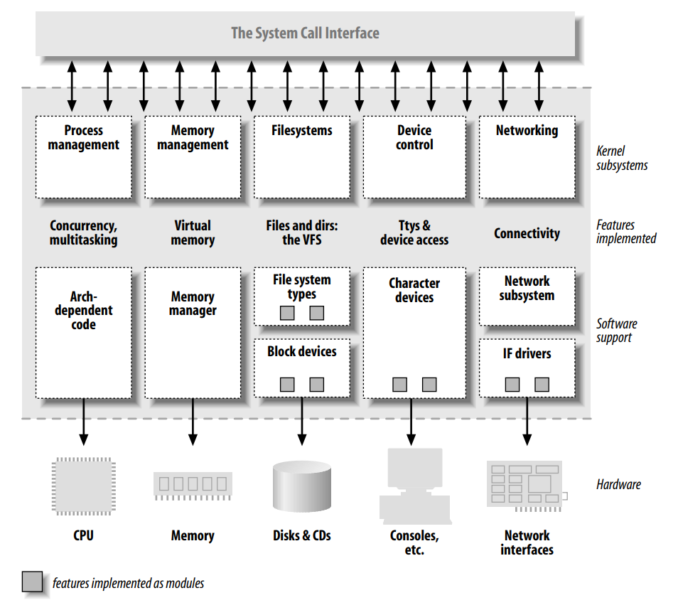

# Chapter 1. An Introduction to Device Drivers

- Device drivers are distinct "block boxes" that make a particular piece of hardware respond to a well-defined internal programming interface.

- We have taken a device-independent approach.

- Each driver is different; as a driver writer, you need to understand your specific device well.

- But most of the principles and basic techniques are the same for all drivers.

- Every new concept is accompanied by sample code that doesn't need special hardware to be tested.

- We introduce some background concepts about the Linux kernel that you'll be glad you know later, when we do launch into programming.

## The Role of the Device Driver

- As a programmer, you are able to make your own choices about your driver, and choose an acceptable trade-off between the programming time required and the flexibility of the result.

- We like the word "flexible" because it emphasizes that the role of a device driver is providing *mechanism*, not *policy*.

- The distinction between mechanism and policy is one of the best ideas behind the Unix design.

- Most programming problems can indeed be split into two parts: "what capabilities are to be provided" (the mechanism) and "how those capabilities can be used" (the policy).

- For example, Unix management of the graphic display is split between the X server, which knows the hardware and offers a unified interface to user programs, and the window and session managers, which implement a particular policy without knowing anything about the hardware.

- Another example is the layered structure of TCP/IP networking: the operating system offers the socket abstraction, which implements no policy regarding the data to be transferred, while different servers are in charge of the services (and their associated policies).

- Moreover, a server like *ftpd* provides the file transfer mechanism, while users can use whatever client they prefer; both command-line and graphic clients exist, and anyone can write a new user interface to transfer files.

- When writing drivers, a programmer should pay particular attention to this fundamental concept: write kernel code to access the hardware, but don't force particular policies on the user, since different users have different needs.

- Sometimes, however, some policy decisions must be made.

    - For example, a digital I/O driver may only offer byte-wide access to the hardware in order to avoid the extra code needed to handle individual bits.

- One major consideration is the trade-off between the desire to present the user with as many options as possible and the time you have to write the driver, as well as the need to keep things simple so that errors don't creep in.

- Policy-free drivers have a number of typical characteristics.

    - These include support for both synchronous and asynchronous operation, the ability to be opened multiple times, the ability to exploit the full capabilities of the hardware, and the lack of software layers to "simplify things" or provide policy-related operations.

- Many device drivers, indeed, are released together with user programs to help with configuration and access to the target device.

    - Often a client library is provided as well, which provides capabilities that do not need to be implemented as part of the driver itself.

- The scope of this book is the kernel, so we try not to deal with policy issues or with application programs or support libraries.

## Splitting the Kernel

- The kernel's role can be split (as shown in Figure 1-1) into the following parts:

    - Process management

        - The kernel is in charge of creating and destroying processes and handling their connection to the outside world.

    - Memory management

        - The kernel builds up a virtual addressing space for any and all processes on top of the limited available resources.

    - Filesystems

        - Unix is heavily based on the filesystem concept; almost everything in Unix can be treated as a file.

    - Device control

        - Almost every system operation eventually maps to a physical device.

    - Networking

        - Networking must be managed by the operating system, because most network operations are not specific to a process: incomming packets are asynchronous events.

### Loadable Modules

- You can add functionality to the Linux kernel while the system is up and running.

- Each piece of code that can be added to the kernel at runtime is called a *module*.

- Each module is made up of object code that can be dynamically linked to the running kernel by the *insmod* program and can be unlinked by the *rmmod* program.

- Figure 1.1 identifies different classes of modules in charge of specific tasks.

> ##### Figure 1-1. A split view of the kernel
>
> 

## Classes of Devices and Modules

- The Linux way of looking at devices distinguishes between three fundamental device types.

- Each module usually implements one of these types, and thus is classifiable as a *char module*, a *block module*, or a *network module*.

- The three classes are:

    - Character devices

        - A character (char) device is one that can be accesses as a stream of bytes.

        - Such a driver usually implements at least the *open*, *close*, *read*, and *write* system calls.

        - The text console (*/dev/console*) and the serial ports (*/dev/ttyS0* and friends) are examples of char devices.

        - Most char devices are just data channels, which you can only access sequentially.

        - There exist, nonetheless, char devices that look like data areas, and you can move back and forth ni them; for instance, this usually applies to frame grabbers, where the applications can access the whole acquired image using *mmap*, or *lseek*.

    - Block devices

        - A block device is a device (e.g., a disk) that can host a filesystem.

        - In most Unix systems, a block device can only handle I/O operations that transfer one or more whole blocks, which are usually 512 bytes in length.

        - Linux, instead, allows the application to read and write a block device like a char device

    - Network interfaces

        - Usually, an *interface* is a hardware device, but it might also be a pure software device, like the loopback interface.

        - A network interface is in charge of sending and receiving data packets, driven the network subsystem of the kernel, without knowing how individual transactions map to the actual packets being transmitted.

        - Many network connections are stream-oriented, but network devices are, usually, designed around the transmission and receipt of packets.

        - A network driver knows nothing about individual connections; it only handles packets.

        - Not being a stream-oriented device, a network interface isn't easily mapped to a node in th filesystem.

        - The Unix way to provide access to interfaces is still by assigning a unique name to them (such as `eth0`).

- In general, some types of drivers work with additional layers of kernel support functions for a given type of device.

    - Every USB device is driven by a USB module that works with the USB subsystem, but the device itself shows up in the system as a char device (a USB serial port, say), a block device (a USB memory card reader), or a network device (a USB Ethernet interface).

- Kernel developers collected class-wide features and exported them to driver implementers to avoid duplicating work and bugs, thus simplifying and strengthening the process of writing such drivers.

- Linux supports the concept of a filesystem module, whose software interface declares the different operations that can be performed on a filesysstem inode, directory, file, and superblock.

## Security Issues

- Any security check in the system is enforced by kernel code.

- When possible, driver writers should avoid encoding security policy in their code.

- Security is a policy issue that is often best handled at higher levels within the kernel, under the control of the system administrator.

- There are always exceptions, however.

    - As a device driver writer, you should be aware of situations in which some types of device access could adversely affect the system as a whole and should provide adequate controls.

- Driver writers must also be careful, of course, to avoid introducing security bugs.

    - *buffer overrun*

- Some other general security ideas are worth keeping in mind.

    - Any input received from user processes should be treated with great suspicion; never trust it unless you can verify it.

    - Be careful with uninitialized before being made available to a user process or device.

    - If your device interprets data sent to it, be sure the user cannot send anything that could compromise the system.

    - Think about the posible effect of device operations.

- Be careful, also, when receiving software from third parties, especially when the kernel is concerned: because everybody has access to the source code, everybody can break and recompile thins.

- Note that the Linux kernel can be compiled to have no module support whatsoever, thus closing any module-related security holes.

- It is also possible, with 2.2 and later kernels, to disable the loading of kernel modules after system boot via the capability mechanism.

## Version Numbering

- *Every* software package used in a Linux system has its own release number, and there are often interdependencies across them.

- To run the examples we introduce during the discussion, you won't need particular versions of any tool beyond what the 2.6 kernel requires; any recent Linux distribution can be used to run our examples.

- We won't detail specific requirements, because the file *Documentation/Changes* in your kernel sources is the best source of such information if you experience any problems.

- As far as the kernel is concerned, the even-numbered kernel versions (i.e., 2.6.x) are the stable ones that are intended for general distribution.

- The odd versions are development snapshots and are quite ephemetal.

- This book covers Version 2.6 of the kernel.

- Our focus has been to show all the features available to device driver writers in 2.6.10.

- Programmers wanting to keep up with kernel programming changes are encouraged to join the mailing lists and to make use of the web sites listed in the bibliography.

- Those who run odd-numbered versions of the kernel are usually skilled enough to dig in the code without the need for a textbook.

- Another feature of Linux is that it is a platform-independent operating system.

- This book is platform independent as far as possible, and all the code samples have been tested on at least the x86 and x86-64 platforms.

## License Terms

- Linux is licensed under Version 2 of the GNU General Public License (GPL), a document devised for the GNU project by the Free Software Foundation.

- The GPL allows anybody to redistribute, and even sell, a product covered by the GPL, as long as the recipient has access to the source and is able to exercise the same rights.

- Additionally, any software product derived from a product covered by the GPL must, if it is redistributed at all, be released under the GPL.

- As far as this book is concerned, most of the code is freely redistributable, either in source or binary form, and neither we nor O’Reilly retain any right on any derived works.

## Joining the Kernel Development Community

- The central gathering point for Linux kernel developers is the *linux-kernel* mailing list.

- Following this list is essential for those who are interested in kernel development.

- To join the linux-kernel list, follow the instructions found in the linux-kernel mailing list FAQ.

- Linux kernel developers are busy people, and they are much more inclined to help people who have clearly done their homework first.
